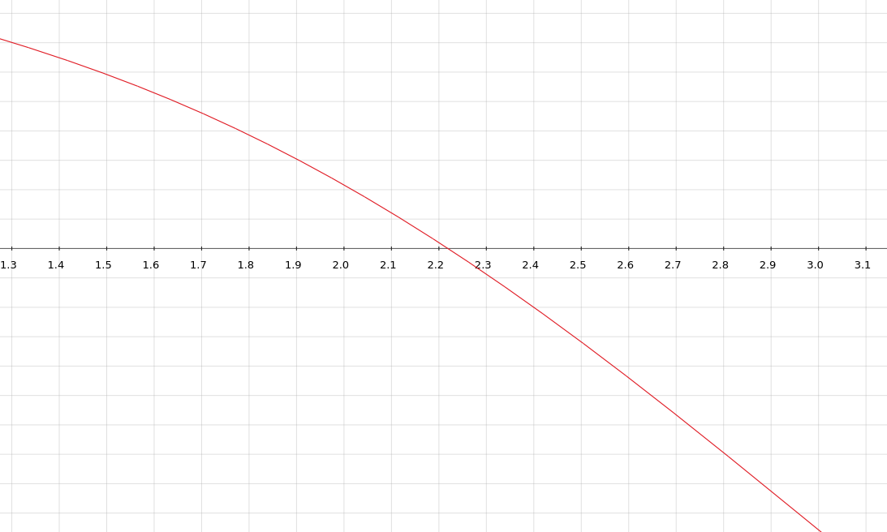

# Metodo di Steffensen

Implementazione del metodo di Steffensen per il calcolo degli zeri di una funzione $(f(\alpha) = 0)$

## Idea generale
L'algoritmo è molto simile a quello di Newton, la differenza sostanziale sta nella sostituzione della derivata prima di $f$ con un'altra funzione $g(x)$, detta _di pendenza_.

La funzione di pendenza $g(x)$ è generata dalla funzione di partenza $f(x)$ con seguente formula:

$$ g(x) = \frac{f(x + f(x)) - f(x)}{f(x)}$$
## Iterata generale

$$ x^{(k+1)} = x^{(k)}-\frac{f(x^{(k)})}{g(x^{(k)})} = x^{(k)}-\frac{[f(x^{(k)})]^2}{f(x^{(k)} + f(x^{(k)})) - f(x^{(k)})}$$ 

----

## Esempio 

Sia $f(x) = \sin(x) - \ln(x)$,
siano, inoltre 
* $x_0 = 3$
* $tolleranza = 10^{-10}$

Oss. L'algoritmo si ferma quando trova un'approssimazione della radice al disotto di una tolleranza (input) oppure quando raggionge il massimo numero di passi stabilito (input).

Oss. Il metodi di Steffensen ha ordine di convergenza quadratico (come quello di Newton), questo metodo viene maggiormente utilizzato nel caso la derivata di $f$ sia troppo difficile/costoso da calcolare.

### Di seguito riportata la tabella delle varie iterate generate con Matlab:

| Passo |    Valore x    | Stima errore  |
|:----: |      :----:    |    :----:     |
| 1     | 2.1916173864   | 3.69e-01      |
| 2     | 2.2190971690   | 1.24e-02      |
| 3     | 2.2191071489   | 4.50e-06      |
